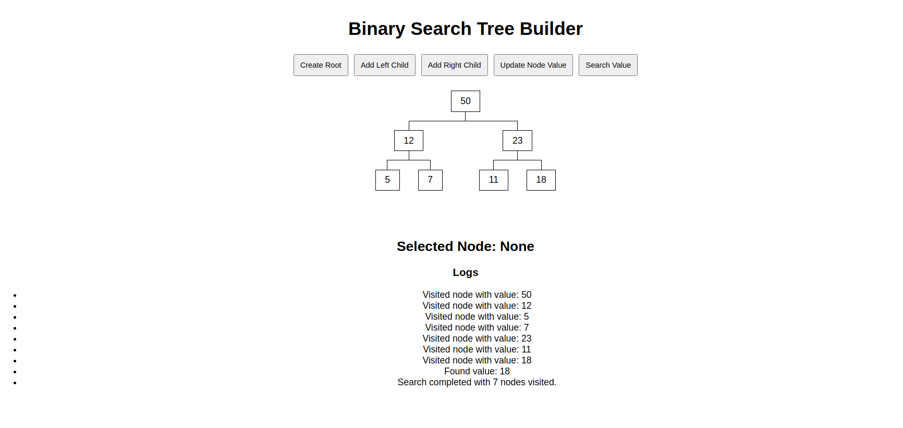

# Customized Binary Search Tree



## Tasks

- User should be able to build the binary search tree.
- User can create the root node, each node has its own values.
- User can select the node and create left or right child with its value.
- If child node has bigger value than the parent, should mark as red
- User should be able to update the value of Node, should display value as static, don't put inputbox directly in the node.
- If there's no red nodes, then user should be able to search certain value and see the detailed logs of how you found it and visited node counts during search.

## Environment

- Ubuntu 22.04
- Node v22.12.0
- Npm 10.9.0

## Tech Stacks

- Vite + React + Typescript
- Treeflex

## Steps to run program

1. Install node modules

   ```shell
   npm install
   ```

2. Run project
   ```shell
   npm run dev
   ```
   This will host the project on http://localhost:5173.
